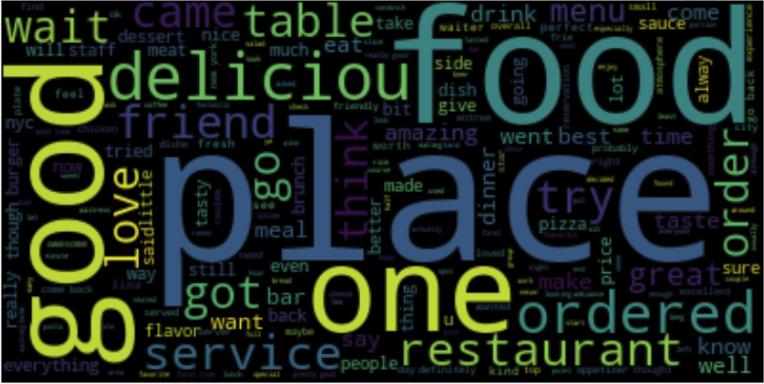
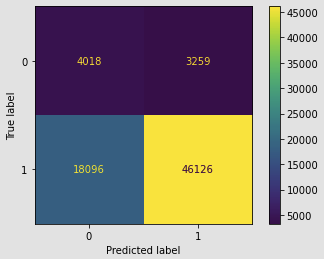
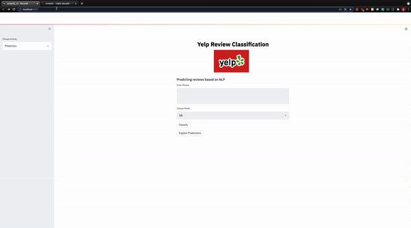

# Yelp Near Truth Analysis Project


## Table of Contents
* [Overview](#Overview)
* [Business Problem](#Business-Problem)
* [Data](#Data)
* [Analysis](#Analysis)
* [Results](#Results)
* [Conclusions](#Conclusions)
* [Demo](#Demo)
* [Next Steps](#Next-Steps)
* [Author](#Author)
* [Repository Structure](#Repository-Structure)

## Overview

Living in a big city gives people options on what they wish to eat and living in a city like New York, the options are nearly limitless. Most people don't go out to eat everyday so when they do, they want to be able to enjoy their meals. With so many options out there, the only way to decide where to go besides relying on personal experience is to rely on the experiences of others in the form of online reviews. Many people turn to reviews for guidance but if the reviews are overloaded with fake input, our opinions can be swayed as well. 


In the figure above, we can see that the overall reviews increase by the year.

This project aims to analyzes the natural language of the users to determine whether a review is truthful or not. The data only analyses 

## Business Problem

There are many reviews written by a variety of people. While most people write to share their experiences of enjoyment or disappointment, some people take advantage of this system to put certain businesses in a good light or harm other businesses just cause they can. What this project aims to tackle is to see if there is a way to differentiate between true reviews and those deemed using Natural Language Processing (NLP). When user expectations don't match up to the reviews of the product or service, people generally would be less likely to trust the review on the website. In this specific case, we want to get restaurant reviews on yelp to be as close to the truth as possible.


## Data


This data is a near-truth from yelp.com obtained from professor Rayana Shebuti which contains 359,052 restaurant reviews. The columns are defined as:

user_id : reference to user
prod_id : the reference to the business
rating : rating of the business by user
label : truth or false (renamed as target in analysis)
date : date when the review was posted
review : review of business by user
name: name is business

Since there are a lot of data within this dataset, 20% of the data was set aside as unseen data. The remaining 80% was split for a training and a testing set.

## Analysis

The objective of this project is to determine whether a review is truthful or not based on the natural language of the reviews. Approximately 1 in 10 reviews within the data were not truthful and we want to see if there is a trend. We want to isolate keywords within the text so stopwords were removed for all models and analysis. Contractions were broken up differently in seperate models to be analyzed. In addition any reviews which were below 15 characters were removed. According to [this source](https://strainindex.wordpress.com/2008/07/28/the-average-sentence-length/), the average characters in a sentence in the english language is between 15-20. We try to keep a conservative stance by only removing those under 15 as there are nearly impossible to predict based on text alone. Some example short reviews are.

- 'Good food'
- 'Good'
- 'Very good food'
- '!'
- '-'
- variations of 'yum' and 'yummy'

After using different methods of cleaning the following models were used to find the best accuracy:

 - logistic model 
 - Multinomial Naive Bayes model
 - Random Forest Model
 - Sequential Neural Network (embedded and non-embedded)
 - GradientBoost model
 - HistGradient Boost (experimental - not considered)

The NB model took the least time and performed around the same as the other model so a gridsearch was used to find the best fit. In this model the most common words in both the truth and the fraud values were removed. The following words are removed from the reviews:

 - "restaurant"
 - "place"
 - "good"
 - "great"



Using this gridsearched model, the prediction probability of each item was obtained and combined with new features created from the data such as number of reviews per user and the year the user has had their account. However, this data did not give favorable results as the probability error was compounded when utilizing the models.


## Results 

The best model simple was the naive bays which came out to be approximately 68% on the training data and 70% on the test dataset. When this model was run on the unseen data, it achieved a surprisingly higher score of 87%. While this number is still shy of the dummy model which predicted 89% simply by classifying all reviews as real, this is not ideal as it is hard to determine if more fakes reviews are added over time. In this unseen data, the majority of the mis-categorized reviews were truthful reviews that were considered fake. This result is not ideal as users would not be pleased to have their review flagged when they put effort into giving their honest review. On the other hand, if too many fake reviews get through and alter the ratings of a restaurant, the user experience is affected and less people will write reviews.



## Conclusion

NLP is a great way to breakdown text for analysis, but it is not ideal to determine if a restaurant's review is genuine or not. The words commonly in real and fake reviews use similar writing style and is difficult to distinguish without more information.

Using a Neural Network model the training and test scores were 90% and 89% respectively. This model performed well on the unseen data as well with an accuracy of 88.9%.
```
Unseen data Confusion Matrix (NN)
TRUE  
  0|   258   |    7019   |          accuracy:  88.93%
  1|   892   |   63330   |            recall:  90.02%
        0          1    
         Predicted
```  
  
```
Unseen data Confusion Matrix (NB)
True
  0|   4018   |    3259   |          accuracy:  87.47%
  1|  18096   |   46126   |            recall:  93.04%
        0            1
          Predicted
```
From the confusion matrix above we can see that the two models have a very different approach to the same reviews. The Neural Network model is more conservative in predicting a fake review while the Naive Bayes took a more aggressive approach. Both model needs improvement as more information is needed for a better prediction. While NLP is a useful tool is great for classifying something completely different, it is not the best tool as a standalone tool for predicting reviews as the manner speech varies from person to person and it applies for both real reviews and the fake ones people create.

## Demo
The following demo is an app created using streamlit to demonstrate the uses of a review detection algorithm. A review is pulled direcrtly from yelp and is processed through the NB model (simplified: does not remove stop words).



## Next Steps

Gather more information on the users as they write reviews so that there are more weight in the model including but not limited to pictures and locations. 

## Author

Eddie Lin <br>
Github: RedDragonfruit

## Source
Collective Opinion Spam Detection: Bridging Review Networks and Metadata. Shebuti Rayana, Leman Akoglu, ACM SIGKDD, Sydney, Australia, August 10-13, 2015
[link here](http://odds.cs.stonybrook.edu/yelpnyc-dataset/)

## Repository Structure

```
├── Images     <-- pictures from online/internally generated  
├── Tool  <-- Custom functions FNC and NN
├── 01_EDA.ipynb     <-- first notebook : cleans and explores the data
├── 02_Initial_model_and_testing.ipynb     <-- second notebook : models for the cleaned data
├── 03_Refining_and_GridSearch.ipynb    <-- Gridseach and testing NB model on unseen
├── 04_Feature_models.ipynb  <-- Models with generated features
├── 05_neural_network_initial.ipynb.  <-- testing sequential models
├── 06_neural_network-refined_and_validation.ipynb. <-- simplified model and testing unseen data
├── README.md
├── streamlit_v2.py. <---- Code to run streamlit app
```
