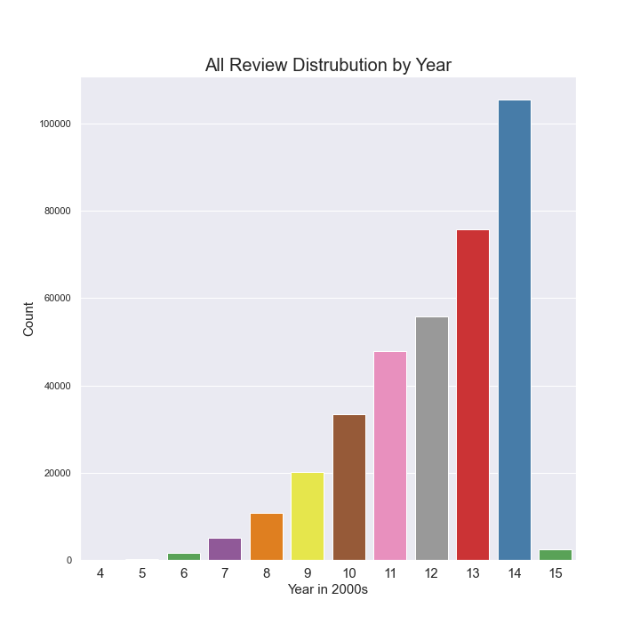
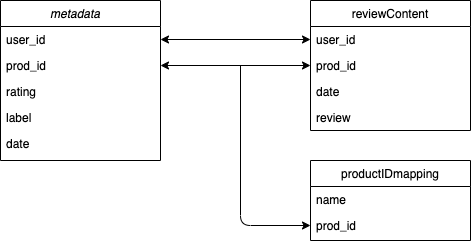

# Yelp Near Truth Analysis Project

## Overview

Living in a big city gives people options on what they wish to eat and living in a city like New York, the options are nearly limitless. Most people don't go out to eat everyday so when they do, they want to be able to enjoy their meals. With so many options out there, the only way to decide where to go besides relying on personal experience is to rely on the experiences of others in the form of online reviews. 

In the figure above, we can see that the overall reviews increase by the year.

This project aims to analyzes the natual language of the users to determine whether a review is truthful or not. The data only analyses 

## Business Problem

lots of reviews, lots of fake, need way to distinguish fake to improve customer satisfation --> scores that accurately reflect good and scores reflecting bad places. --> leads to trust in app, happier userbase.

## Data

This data is a near-truth from yelp.com obtained from professor Rayana Shebuti which contains 359,052 restaurant reviews. The columns are defined as:

user_id : reference to user
prod_id : the reference to the business
rating : rating of the business by user
label : truth or false (renamed as target in analysis)
date : date when the review was posted
review : review of business by user
name: name is business

## Analysis

The objective of this project is to determine whether a review is truthful or not initially only based on the natural language of the review. Approximately 1 in 10 reviews within the data were not truthful and we want to see if there is a trend. We want to isoloate keywords within the text so stopwords were removed for all models and analysis. Contractons were broken up differently in seperate models to be analyzed. In addition any reviews which were below 15 characters were removed. According to [this source](https://strainindex.wordpress.com/2008/07/28/the-average-sentence-length/), the average characters in a english language is between 15-20. We try to keep a conservative stance by only removing those under 15 as there are nearly impossible to predict based on text alone. Some example short reviews are.

- 'Good food'
- 'Good'
- 'Very good food'
- '!'
- '-'
- variations of 'yum' and 'yummy'

After using different methods of cleaning, we run the the cleaned text through multinomial Naive Bayes models where high accuracy was determined to be the best metric.

[RUN NEW FEATURE HERE]

## Results 

## Conclusion

## Next Steps

## Source
Collective Opinion Spam Detection: Bridging Review Networks and Metadata. Shebuti Rayana, Leman Akoglu, ACM SIGKDD, Sydney, Australia, August 10-13, 2015
## Repository Structure
